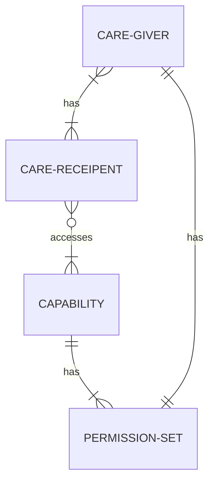
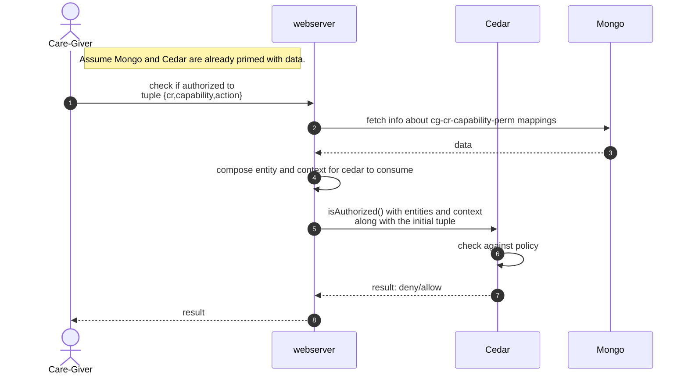

# Mongo-Cedar POC
This POC combines MongoDB and [Cedar Authorization Engine](https://docs.cedarpolicy.com/) to implement the authorization checks for CareGivers(CG) to perform actions on behalf of CareReceipents(CR). The code uses Docker Compose for orchestration and creates 2 apps, one for the hosting Cedar engine and the webserver. The other one hosts MongoDB which is where the data about the entities live.

The usecase can be explained as follows:
A CR can assign one or more CGs for managing each Capability (in this case, UserProfile and Documents) and provide them with different Permissions at the capability level.

Whenever the CG invokes a `check` , to check if they have access to a tuple `{cr id, capability id, action}`, we compose the Cedar Entities and Context in real-time and feed it to the Authz Engine to verify if the data abides by the Policy.

## Entity Relationship Diagram


TODO: Add mermaid ERD
## Instructions
Use instructions in `Makefile` to start the service
```bash
make up
```
To clean up after the run, do:
```bash
make clean
```

Use the following to set up a sample CG-CR pair:
```bash
curl --location --request POST 'localhost:8888/insert-example'
```

And use `check` to verify authz:
```bash
curl --location 'localhost:8888/check' --header 'Content-Type: application/json' --data '{"cg":"cg1","cr":"cr14","action":"READ","resource":"UserProfile"}'
```

**NOTE:** Currently the 2 resources configured are `UserProfile` and `Documents`

## Workflow
How the authz check is meant to happen using `Cedar + Mongo`



## K6 Data
We can use k6 to run perf tests.
Inorder to do this, we need to run the following cURL to setup the perf test data:
```bash
curl --location --request POST 'localhost:8888/insert-perf-data'
```

Once that is done, running a `check` would give us this:
